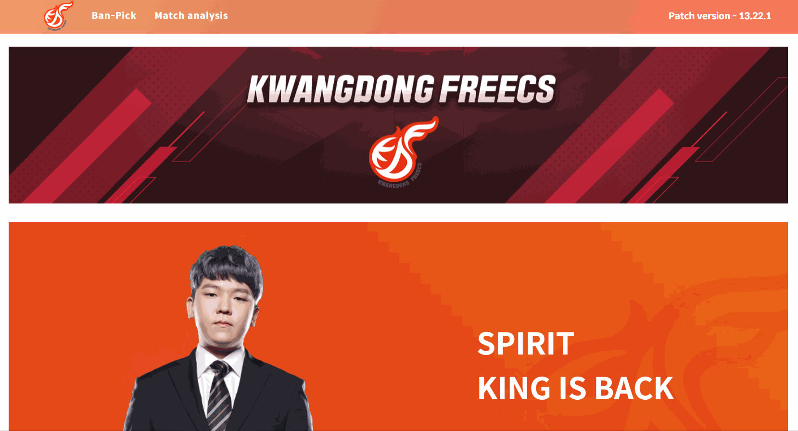
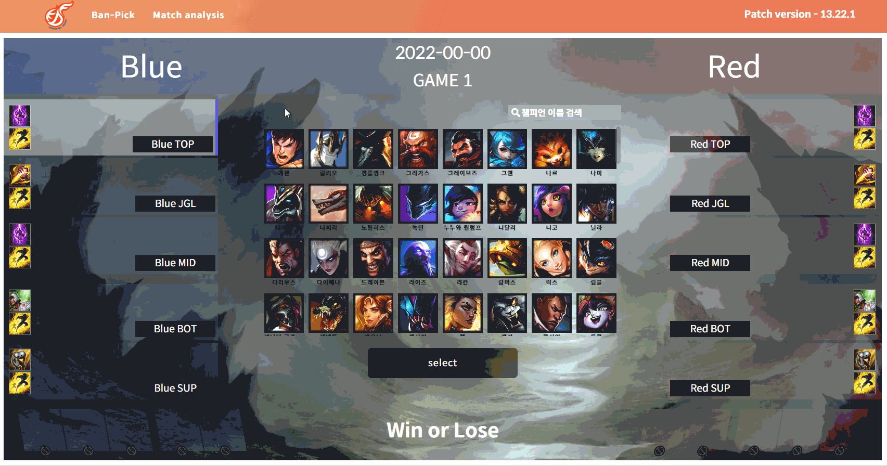
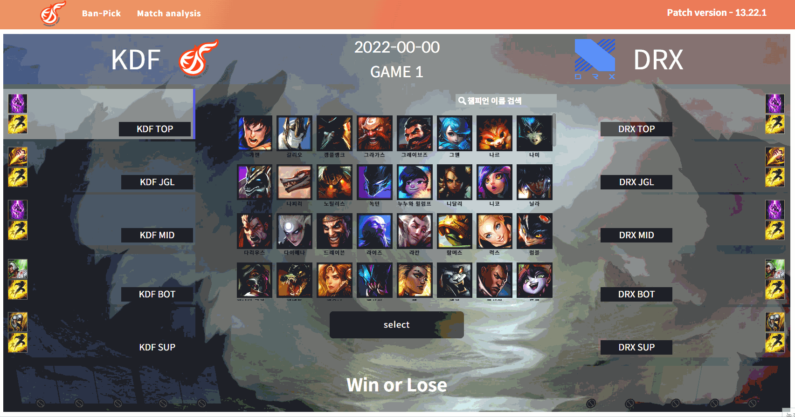
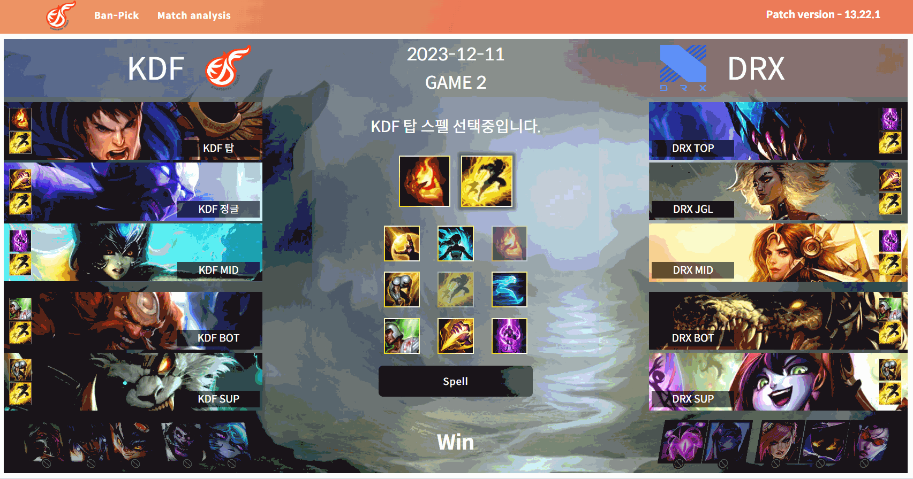
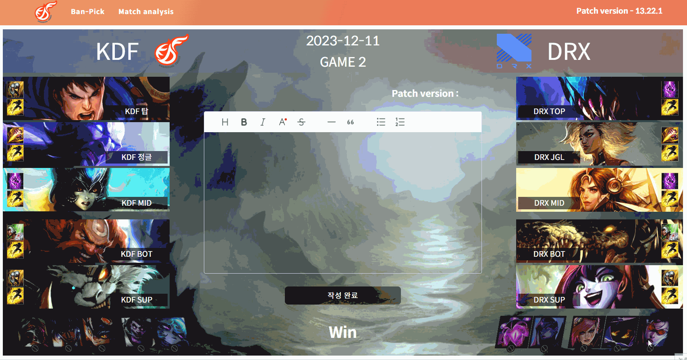

# [LOL-ban-pick-simulator](https://banpick-simulator.netlify.app)

## 🎯 서비스 소개

**LOL ban-pick simulator**는 E-sports 프로게이머 팀 코치인 지인의 비효율적인 업무를 개선하고 효율을 높이기 위해 제작한 웹페이지 기반의 업무 툴입니다.
게임 내 캐릭터 선택 방식인 ban-pick 시스템을 시뮬레이션하여 업무에 필요한 게임 결과 자료를 빠르게 만들 수 있습니다.

## 프로젝트 기간

2022.05 ~ 2022.07(2개월)

## ⚡️ 기술 스택

React, SCSS, CRA

## 😀 사용 설명서

### 모드 선택

상단 네비게이션 메뉴의 `Ban-Pick` 탭을 선택해주세요.  
`빠른 결과` 모드를 선택하고 `밴픽하러가기` 버튼을 눌러주세요.

 

### 팀 선택 기능

2022시즌 LCK 팀을 선택할 수 있습니다.
선택한 팀이 **선수명에 자동으로 입력됩니다.**

 

### 경기 결과 기록

선수명, 경기 날짜, 라운드, 승/패 결과를 입력할 수 있습니다.

 

### 챔피언 선택

챔피언을 선택하세요!  
검색을 통해 빠르게 선택할 수 있습니다. (초성 검색도 지원합니다😀)

선택한 챔피언은 언제든지 자유롭게 변경 가능합니다.

 

### 스펠 선택

스펠을 선택하세요! (LCK 기준 라인별 기본 스펠이 선택되어 있습니다😀)

선택한 스펠은 언제든지 자유롭게 변경 가능합니다.

 

### 경기 피드백 작성

경기 피드백을 작성하세요!
자유로운 에디터를 지원합니다.

작성한 피드백은 언제든지 자유롭게 변경 가능합니다.

 

### 결과 다운로드 or 캡쳐

작성한 데이터를 저장하세요!

`결과 다운로드` 버튼을 선택해 다운로드 할 수 있습니다.(이미지 및 글씨 크기가 조정됨에 유의하세요.)

원본 그대로의 결과를 원한다면 `직접 캡쳐` 버튼을 선택하세요.(전체화면으로 전환됩니다.)

